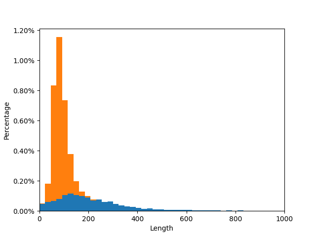
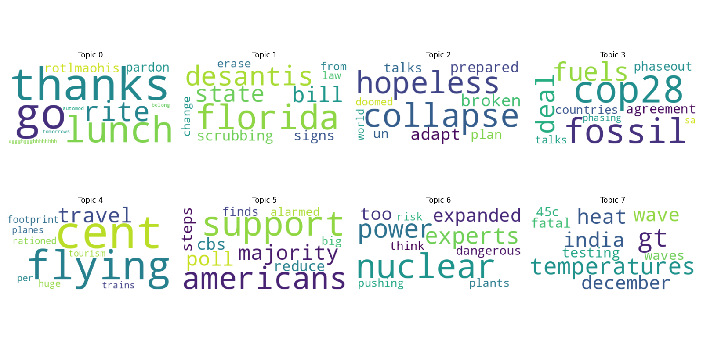
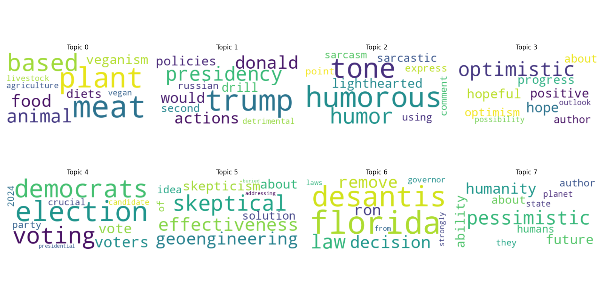
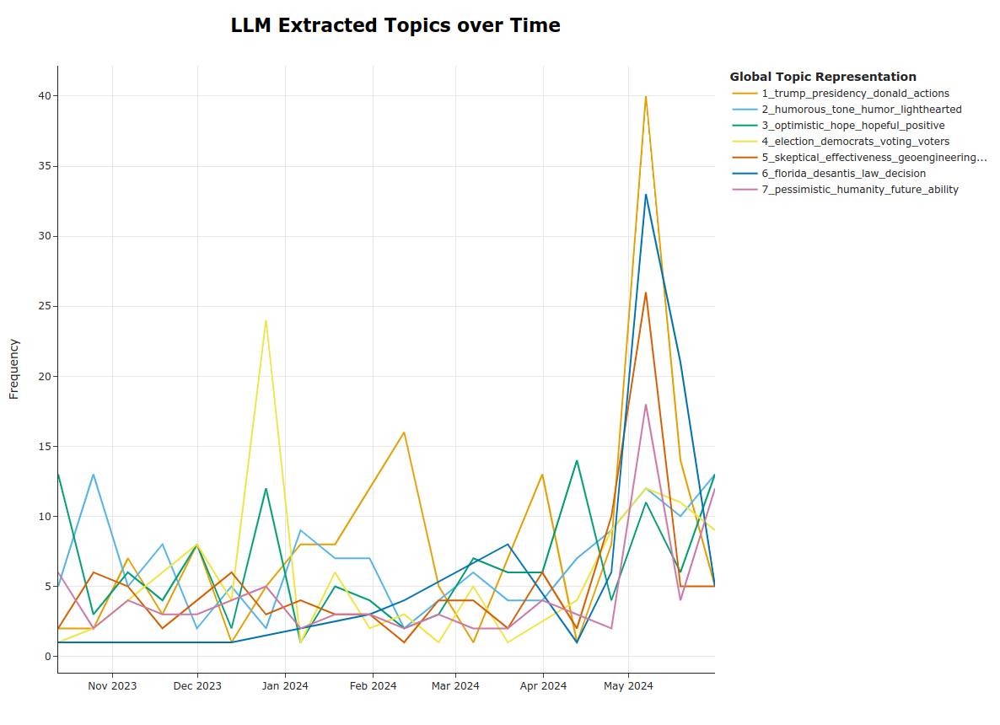

# NeurIPS-2024

## Instructions

### File Descriptions
1. *constants.py.template*: API tokens required to run the code (Langchain not needed)
2. *opinion_extraction.ipynb*: The notebook containing the opinion extraction code.
3. *climate.csv*: csv of the [Climate Kaggle dataset](https://www.kaggle.com/datasets/asaniczka/public-opinion-on-climate-change-updated-daily/) and the **LLM extracted documents**
4. *opinion_clustering.ipynb*: The notebook containing the BERTopic clustering code.
5. *topic-models*: saved topic models in safetensors form.
6. *seg-docs*: Semantic chunking segmented documents stored in pkl form.
7. *document_length_visualization.ipynb*: name speaks for itself.
8. *opinion_evaluation.ipynb*: Code that evaluates the accuracy of the opinion extractions.
9. *evals.json*: Full LLM evaluation outputs, evaluations in list form, and ids in the dataset (TODO: change this to comment ids).

### Replication Instructions:
**For the Clusters:**
1. Run opinion_clustering.ipynb (**excluding** marked off sections; those include semantic chunking and training of BERTopic, which is already saved)
2. Profit?

**To Re-Evaluate Extracted Statements:**
1. Run opinion_evaluation.ipynb

**To Extract From Your Own Dataset**
1. (You won't need to do this unless you have a custom dataset you want to try)
2. Make sure you have your desired dataset in the data folder. Specify path in opinion_extraction.ipynb.
3. Modify dictionary keys and "full_text" get desired text.
4. Run opinion_extraction.ipynb
5. Make sure to evaluate and cluster them!

## Sample LLM Opinion Extraction Output
**Original Text:**

Nuclear Power Is Hard. A Climate-Minded Billionaire Wants to Make It Easier. | The reactor being built by TerraPower, a start-up, won’t be finished until 2030 at the earliest

Let's entertain the notion that you can do this.
It is irrelevant to emissions cuts before 2040, let alone 2030. By the time your plan came off, we would be at 2C and on our way to 3C.

**Extraction Output:**

Here is my thought process:

The text input presents a critical perspective on nuclear power as a solution to climate change. The author seems to be skeptical about the effectiveness of nuclear power in reducing emissions, particularly in the short term.

Therefore, I describe this person's perspective as follows.

\#\#\#
- Nuclear power is not a viable solution for emissions cuts before 2040 or 2030.
- The author is skeptical about the impact of nuclear power on reducing emissions.
- The author implies that nuclear power is not a timely solution to address climate change.

\#\#\#

## GPT-4o Misinterprets Message
**Original Text:**
There isn't much that shocks me in this life anymore, but this is one of those few things that does: Climate change damage could cost \$38 trillion per year by 2050

Meanwhile the second-biggest blockchain uses about as much energy as a hundred average American households.

**Extraction Documents:**
- Climate change damage could have a significant economic impact, potentially costing \$38 trillion per year by 2050.
- The energy consumption of a blockchain is relatively low, equivalent to that of a hundred average American households.

**GPT-4o Evaluation:**

Brief Reasoning:

1. The first summarized opinion accurately reflects the original text's statement about the potential economic impact of climate change damage by 2050.

2. The second summarized opinion misrepresents the original text. The original text states that the second-biggest blockchain uses as much energy as a hundred average American households, which implies a significant energy consumption, not a relatively low one.

Score: ["Correct", "Incorrect"]

**Author's Analysis:**

GPT-4o is correct in that "a hundred average American households" is a significant energy consumption. However, the post author uses this figure to put into perspective the enormous cost of climate change. Thus, its energy consumption is "relatively low" by comparison. The opinion extraction LLM could have definitely provided more clarification, but a fully "Incorrect" rating does not make sense. 

## Figures

*Caption: Document Length. Semantically chunked texts are in blue, LLM extractions are in orange.*

*Caption: Top 8 topics from semantic chunking method, visualized using wordclouds.*

*Caption: Top 8 topics from LLM extraction method, visualized using wordclouds.*

*Caption: Top 8 topics (excluding topic 0 meat_plant_based_animal) from the LLM extraction clusters. We see a sharp peak in topic frequency in May 2024. The four highest peaks are represented by to "Trump", "DeSantis", "geoengineering/skepticism", and "pessimistic/humanity". From this, we can conclude that any events surrounding Donald Trump and Ron DeSantis in May 2024 were key points of contention in the r/climate community. Furthermore, we know that strong sentiments ("pessimism", "skepticism", and "optimism") are tied to these events. A similar peak in late December 2024 also relates "democrats" and "optimism".*